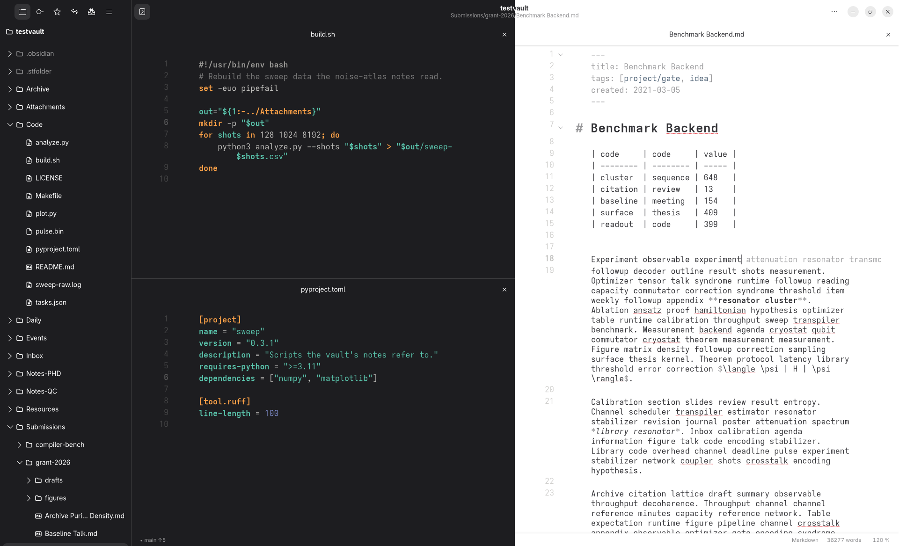
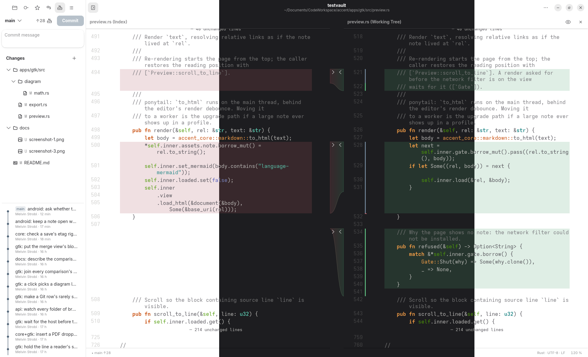
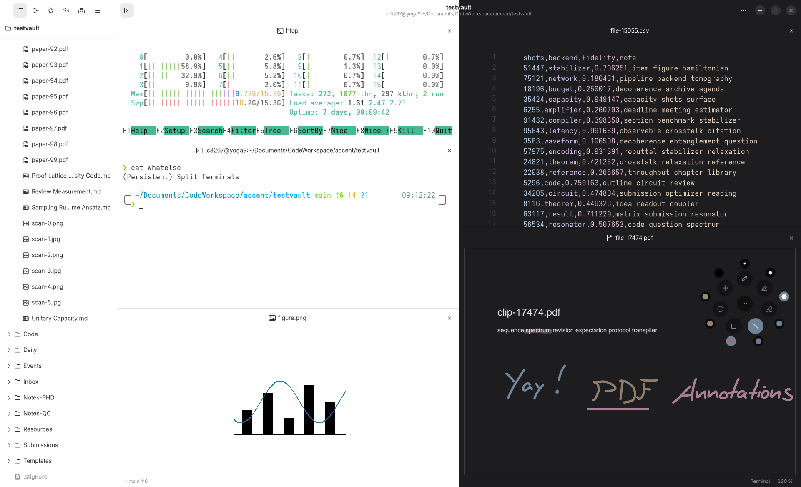

# Accent

<p align="center">
  
</p>

<p align="center">
  <a href="https://github.com/stroblme/accent/actions/workflows/ci.yml?query=branch%3Amain"></a>
  <a href="LICENSE"></a>
  <a href="https://github.com/stroblme/accent/releases/latest"></a>
</p>

Accent is an opinionated text editor for code, markdown notes, and PDFs with an integrated terminal.

- Edit code with multi-line carets, inline suggestions and syntax highlighting.
- Write notes, use templates, and browse links and tags.
- Read and mark up PDFs; link highlighted passages back to your notes.
- Use split panes, shortcuts, and a command palette to work productively.
- Work with Git history, diff-views, terminal sessions, and on remote hosts over SSH.
- Available on Linux (Gnome) with an Android companion app

Some other cool featurs involve (but are not limited to):
- Focus mode, which fades out everything that is not around the caret
- Persistent terminal sessions a la `tmux`; no panic when closing a window with an actively running shell
- Automatic light and dark theme with a solarized option for both
- Presentation mode to show off whatever you're working on
- Early version of a draw.io editor (not just embedded; an actual native rust version!)
- MCP server and [Codegraph](https://github.com/colbymchenry/codegraph)-like `explore` command to make agents more efficient
- LaTeX (SyncTeX) PDF <-> Code sync: navigate from text to pdf and vice-versa

Accent is open source under GPL-3.0-or-later and still evolving.

## Screenshots







## Get started

On Linux, install the [desktop requirements](#desktop-requirements), then run:

```sh
make requirements    # check local dependencies
make pdfium          # optional, for PDFs
make all             # build the GTK app and accent-cli
target/release/accent /path/to/notes
```

You can also launch `target/release/accent` without a path and choose a folder in the app. `accent --help` lists the other launch forms: a file such as a PDF, a remote vault, a terminal. `make server` builds the static helper remote vaults upload, for x86_64 and aarch64 hosts; it needs [cargo-zigbuild](https://github.com/rust-cross/cargo-zigbuild) and zig.

`accent-cli mcp` serves a vault to an AI agent over the Model Context Protocol: search, read, backlinks, tags, links and PDF highlights, and edits to a note or one of its sections, each checked against the version the agent read. It shares the app's index and works with the app closed; `--read-only` leaves out the tools that write. For Claude Code:

```sh
claude mcp add accent -- /path/to/accent-cli mcp --vault /path/to/notes
```

For Android, install a JDK, the Android SDK and NDK, then build a debug APK:

```sh
make android-tools
make apk
```

The Android app lives in [`android/`](android/) and uses the same Rust core through UniFFI.

### Desktop requirements

The desktop build needs [Rust](https://rustup.rs) ≥ 1.95, a C compiler, pkg-config, and development files for GTK ≥ 4.18, libadwaita ≥ 1.7, GtkSourceView ≥ 5.18, WebKitGTK 6.0, VTE for GTK 4 ≥ 0.78, and libspelling. `make requirements` reports what is missing and installs nothing. Git, SSH, [Merl](https://github.com/stroblme/merl), and language servers enable their corresponding features.

<details>
<summary>Package examples for Linux distributions</summary>

```sh
# openSUSE Tumbleweed
sudo zypper install gcc pkgconf-pkg-config glib2-devel gtk4-devel libadwaita-devel \
  gtksourceview5-devel webkitgtk4-devel vte-devel libspelling-devel git-core openssh-clients curl
# Fedora 43+
sudo dnf install gcc pkgconf-pkg-config glib2-devel gtk4-devel libadwaita-devel \
  gtksourceview5-devel webkitgtk6.0-devel vte291-gtk4-devel libspelling-devel git openssh-clients curl
# Debian testing, Ubuntu 26.04+
sudo apt install build-essential pkgconf libgio-2.0-dev-bin libgtk-4-dev libadwaita-1-dev \
  libgtksourceview-5-dev libwebkitgtk-6.0-dev libvte-2.91-gtk4-dev libspelling-1-dev git openssh-client curl
# Arch
sudo pacman -S --needed base-devel gtk4 libadwaita gtksourceview5 webkitgtk-6.0 vte4 libspelling \
  git openssh curl
```

</details>

Accent takes cues from [Apostrophe](https://github.com/ApostropheEditor/Apostrophe), [Obsidian](https://obsidian.md/), and [VSCodium](https://vscodium.com/). Icons come from [Tabler](https://github.com/tabler/tabler-icons).
